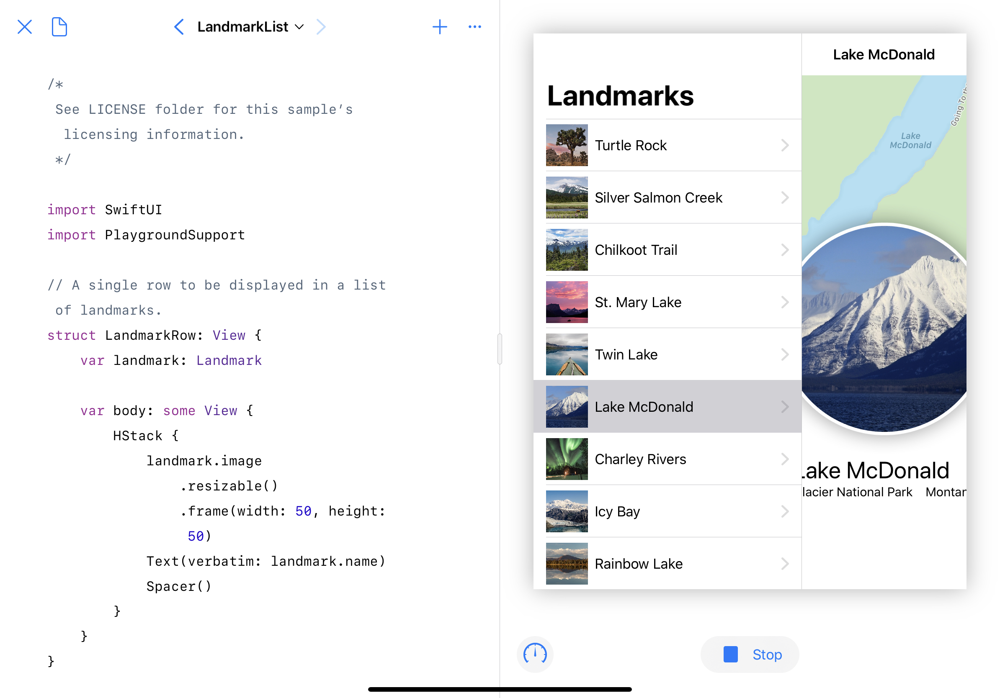
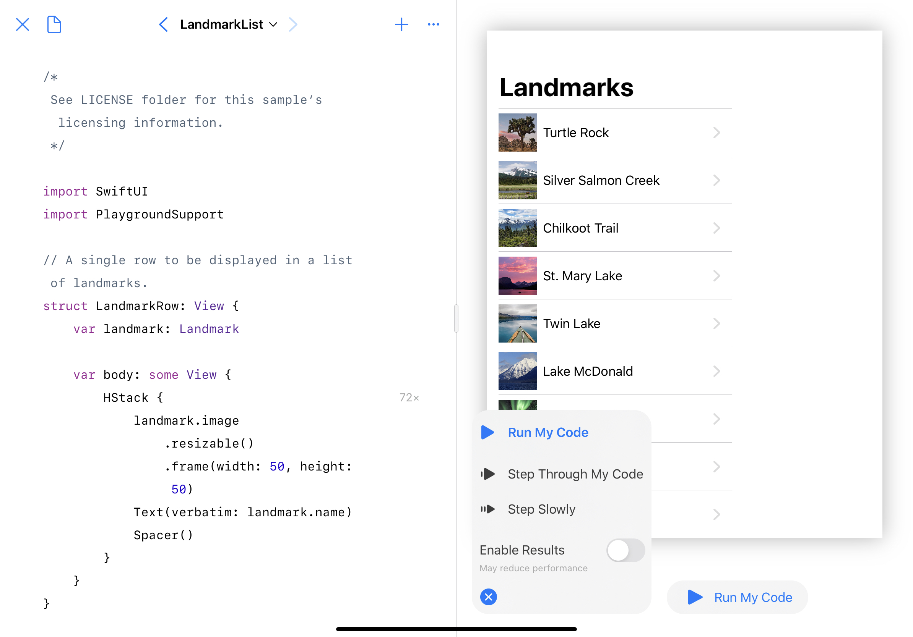

# SwiftUI Tutorials for the iPad
Apple's  SwiftUI Tutorial Sample Code adapted for the Swift Playgrounds app for the iPad.

## Why?
Because sometimes it's easier to reach out for the iPad in order to use it for rapid prototyping.

## Requirements
iOS 13 and Swift Playgrounds 3.1

## Included tutorials

1. `Building Lists and Navigation` from https://developer.apple.com/tutorials/swiftui/building-lists-and-navigation

## Troubleshooting
If LiveView rendering is laggy, turn off `Enable Results` 

